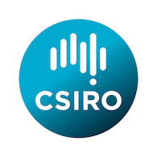

name: 'Home'
show_breadcrumbs: False
show_table_of_contents: False

Numbat
{: class="center-align" style="font-size:300%;font-weight:600"}

(**Num**erical **B**ousinesq **a**dvective **t**ransport)
{: class="center-align" style="font-size:150%;font-weight:300"}

!media media/convection.png width=75% margin=auto

High-resolution simulations of density-driven convective mixing in porous media
{: class="center-align" style="font-size:150%;font-weight:300"}

  

    

      Numbat is an open source <a href = http://www.mooseframework.com>MOOSE</a> application for high-resolution simulations of buoyancy-driven convection in porous media in both two and three dimensions. It solves the coupled convection-diffusion and Darcy equations with the Boussinesq approximation using the finite element method.

      Several formulations are available: from the full, dimensional governing equations, to a dimensionless streamfunction formulation.
        
      As a MOOSE app, it provides access to powerful MOOSE features such as adaptive mesh refinement, hybrid parallelism, both continuous and discontinuous Galerkin methods, and much more, all wrapped in a simple interface.
    

    

        
       
      Numbat is developed on <a href=http://www.github.com/cpgr>GitHub</a> by <a href=http://www.csiro.au>CSIRO</a>.
    

  

