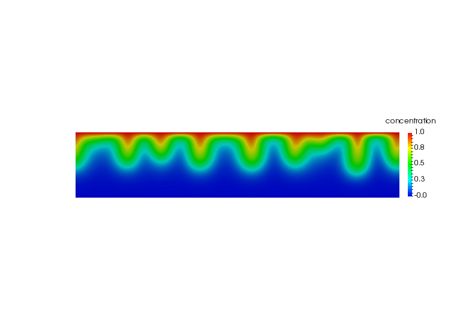
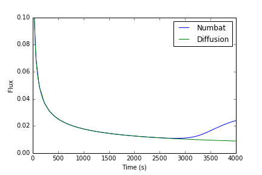

# 2D example

A working example of a 2D problem can be found at [https://github.com/cpgr/numbat/blob/master/examples/2D/isotropic/2Dddc.i](https://github.com/cpgr/numbat/blob/master/examples/2D/isotropic/2Dddc.i).

## Input file

The complete input file for this problem is

    [Mesh]
      type = GeneratedMesh
      dim = 2
      xmax = 1000
      ymin = -200
      ymax = 0
      nx = 80
      ny = 20
      bias_y = 0.7
    []

    [Adaptivity]
      marker = combomarker
      max_h_level = 1
      initial_marker = boxmarker
      initial_steps = 1
      [./Indicators]
        [./gradjumpindicator]
          type = GradientJumpIndicator
          variable = concentration
        [../]
      [../]
      [./Markers]
        [./errormarker]
          type = ErrorToleranceMarker
          refine = 0.005
          indicator = gradjumpindicator
        [../]
        [./boxmarker]
          type = BoxMarker
          bottom_left = '0 -1.0 0'
          top_right = '1000 0 0'
          inside = refine
          outside = dont_mark
        [../]
        [./combomarker]
          type = ComboMarker
          markers = 'boxmarker errormarker'
        [../]
      [../]
    []

    [Variables]
      [./concentration]
        order = FIRST
        family = LAGRANGE
        [./InitialCondition]
          type = PerturbationIC
          variable = concentration
          amplitude = 0.02
          seed = 1
        [../]
      [../]
      [./streamfunction]
        order = FIRST
        family = LAGRANGE
        initial_condition = 0.0
      [../]
    []

    [Kernels]
      [./TwoDDarcyDDC]
        type = DarcyDDC
        variable = streamfunction
        concentration_variable = concentration
      [../]
      [./TwoDConvectionDiffusionDDC]
        type = ConvectionDiffusionDDC
        variable = concentration
        streamfunction_variable = streamfunction
        coeff_tensor = '1 0 0 0 1 0 0 0 1'
      [../]
      [./TimeDerivative]
        type = TimeDerivative
        variable = concentration
      [../]
    []

    [AuxVariables]
      [./u]
        order = CONSTANT
        family = MONOMIAL
      [../]
      [./w]
        order = CONSTANT
        family = MONOMIAL
      [../]
    []

    [AuxKernels]
      [./uAux]
        type = VelocityDDCAux
        variable = u
        component = x
        streamfunction_variable = streamfunction
      [../]
      [./wAux]
        type = VelocityDDCAux
        variable = w
        component = y
        streamfunction_variable = streamfunction
      [../]
    []

    [BCs]
      [./conctop]
        type = DirichletBC
        variable = concentration
        boundary = top
        value = 1.0
      [../]
      [./streamfuntop]
        type = DirichletBC
        variable = streamfunction
        boundary = top
        value = 0.0
      [../]
      [./streamfunbottom]
        type = DirichletBC
        variable = streamfunction
        boundary = bottom
        value = 0.0
      [../]
      [./Periodic]
        [./x]
          variable = 'concentration streamfunction'
          auto_direction = x
        [../]
      [../]
    []

    [Executioner]
      type = Transient
      dtmax = 100
      end_time = 2500
      start_time = 1
      solve_type = PJFNK
      nl_abs_tol = 1e-10
      [./TimeStepper]
        type = IterationAdaptiveDT
        dt = 1
        cutback_factor = 0.5
        growth_factor = 2
      [../]
      [./TimeIntegrator]
        type = LStableDirk2
      [../]
    []

    [Postprocessors]
      [./boundaryfluxint]
        type = SideFluxIntegral
        variable = concentration
        boundary = top
        diffusivity = 1
      [../]
      [./numdofs]
        type = NumDOFs
      [../]
    []

    [Preconditioning]
      [./smp]
        type = SMP
        full = true
      [../]
    []

    [Outputs]
      [./console]
        type = Console
        perf_log = true
        output_nonlinear = true
      [../]
      [./exodus]
        type = Exodus
        file_base = 2Dddc
        execute_on = 'INITIAL TIMESTEP_END'
      [../]
      [./csvoutput]
        type = CSV
        file_base = 2Dddc
        execute_on = 'INITIAL TIMESTEP_END'
      [../]
    []

## Running the example

This example can be run on the commandline using

    numbat-opt -i 2Dddc.i

Alternatively, this file can be run using the *Peacock* gui provided by MOOSE using

    peacock -i 2Dddc.i

in the directory where *2Dddc.i* resides.

## Results

This 2D example should take only a few minutes to run to completion, producing a concentration profile similar to that presented in Figure @fig:2D, where several downwelling plumes of high concentration can be observed:

{#fig:2D}

 
Note that due to the random perturbation applied to the initial concentration profile, the geometry of the concentration profile obtained will differ from run to run.

The flux over the top boundary is of particular interest in many cases (especially convective mixing of $\textrm{CO}_2$). This is calculated in this example file using the *boundaryfluxint* postprocessor in the input file, and presented in Figure @fig:2Dflux.

{#fig:2Dflux}

 
Initially, the flux is purely diffusive, and scales as $1 / \sqrt(\pi t)$, where $t$ is time (shown as the dashed green line). After some time, the convective instability becomes sufficiently strong, at which point the flux across the top boundary rapidly increases (at a time of approximately 1,500 seconds).
